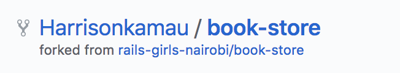
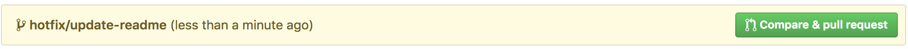
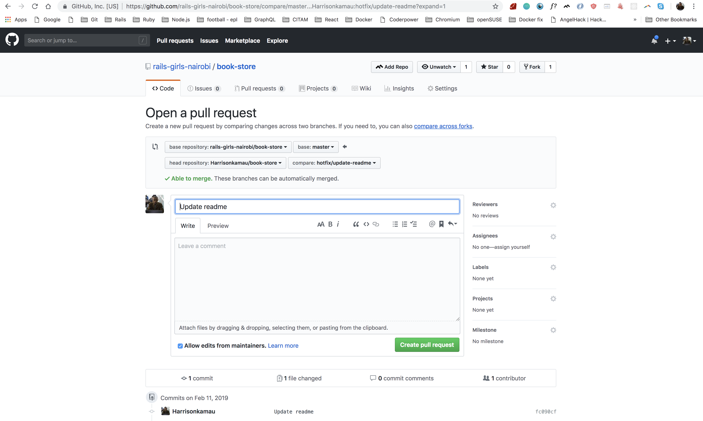

# Guide to contributing to Rails Girls projects/repositories

This is a guide to contributing to an open source project that uses GitHub. It’s mostly based on how I’ve seen various organizations operate. However, this is a general guide so check your project’s README for specifics.

### Step 1: Set up a working copy on your computer
Firstly you need a local fork of the the project, so go ahead and press the `fork` button in GitHub. This will create a copy of the repository in your own GitHub account and you’ll see a note that it’s been forked underneath the project name:

Change into the new project’s directory:

> $ cd book-store

Finally, in this stage, you need to set up a new remote that points to the original project so that you can grab any changes and bring them into your local copy. Firstly clock on the link to the original repository – it’s labeled “Forked from” at the top of the GitHub page. This takes you back to the projects main GitHub page, so you can find the “SSH clone URL” and use it to create the new remote, which we’ll call upstream.

> $ git remote add upstream git@github.com:rails-girls-nairobi/book-store.git

> $ git remote add upstream git@github.com:rails-girls-nairobi/book-store.git

You now have two remotes for this project on disk:
  1. `origin` which points to your GitHub fork of the project. You can read and write to this remote.
  2. `upstream` which points to the main project’s GitHub repository. You can only read from this remote.

### Step 2: Get it working on your machine
Now that you have the source code, get it working on your computer. Hopefully there will be documentation how to do this in the README file.

If you get it working, but the documentation is unclear, then improving that bit should be your first PR to the project. This happens to me a lot and I’ve updated getting-started docs a lot as my first PR to a project!

### Step 3: Do some work
This is the fun bit where you get to contribute to the project. It’s usually best to start by fixing a bug that is either annoying you or you’ve found on the project’s issue tracker. If you’re looking for a place to start, a lot of projects use the `easy pick` label (or some variation) to indicate that this issue can be addressed by someone new to the project.

Now that you have picks an issue, reproduce it on your version. Once you have reproduced it, read the code to work out where the problem is. Once you’ve found the code problem, you can move on to fixing it.

### Branch!
The number one rule is to put each piece of work on its own branch. If the project is using [git-flow](https://www.atlassian.com/git/tutorials/comparing-workflows/gitflow-workflow), then it will have both a master and a develop branch. The general rule is that if you are bug fixing, then branch from master and if you are adding a new feature then branch from develop. If the project only has a master branch, the branch from that. In this case, pick the branch that’s relevant.

For this example, we’ll assume we’re fixing a bug in book-store, so we branch from master:

> $ git checkout master

> $ git pull upstream master && git push origin master

> $ git checkout -b hotfix/readme-update

> $ git checkout master

> $ git pull upstream master && git push origin master

> $ git checkout -b hotfix/readme-update

Firstly we ensure we’re on the master branch. Then the git pull command will sync our local copy with the upstream project and the git push syncs it to our forked GitHub project. Finally we create our new branch. You can name your branch whatever you like, but it helps for it to be meaningful. Including the issue number is usually helpful. If the project uses git-flow as book-store does, then there are specific naming conventions where the branch is prefixed with `hotfix/` or `feature/`.

Now you can do the work to fix the issue.

If the project has tests, run them to ensure you haven’t broken anything. You may also add a new test to show that your change fixes the original problem.

Ensure that you only fix the thing you’re working on. Do not be tempted to fix some other things that you see along the way, including formatting issues, as your PR will probably be rejected.

Make sure that you commit in logical blocks. Each commit message should be sane. Read Tim Pope’s [A Note About Git Commit Messages](https://tbaggery.com/2008/04/19/a-note-about-git-commit-messages.html).

### Step 4: Create the PR
To create a PR you need to push your branch to the origin remote and then press some buttons on GitHub.

To push a new branch:

 $ git push -u origin hotfix/readme-update 

$ git push -u origin hotfix/readme-update 

This will create the branch on your GitHub project. The `-u` flag links this branch with the remote one, so that in the future, you can simply type git push origin.

Swap back to the browser and navigate to your fork of the project (https://github.com/Harrisonkamau/book-store in my case) and you’ll see that your new branch is listed at the top with a handy “Compare & pull request” button:

Go ahead and press the button!

On this page, ensure that the “base fork” points to the correct repository and branch. Then ensure that you provide a good, succinct title for your pull request and explain why you have created it in the description box. Add any relevant issue numbers if you have them.

If you scroll down a bit, you’ll see a diff of your changes. Double check that it contains what you expect.

Once you are happy, press the “Create pull request” button and you’re done.

### Step 5: Review by the maintainers
For your work to be integrated into the project, the maintainers will review your work and either request changes or merge it.

Lorna Mitchell’s article Code Reviews: [Before You Even Run The Code](https://lornajane.net/posts/2015/code-reviews-before-you-even-run-the-code) covers the things that the maintainers will look for, so read it and ensure you’ve made their lives as easy as possible.

## To sum up
That’s all there is to it. The fundamentals are:

> Fork the project & clone locally.

> Create an upstream remote and sync your local copy before you branch.

> Branch for each separate piece of work.

> Do the work, write good commit messages, and read the CONTRIBUTING file if there is one.

> Push to your origin repository.

> Create a new PR in GitHub.

> Respond to any code review feedback.

If you want to contribute to an open source project, the best one to pick is one that you are using yourself. The maintainers will appreciate it!
